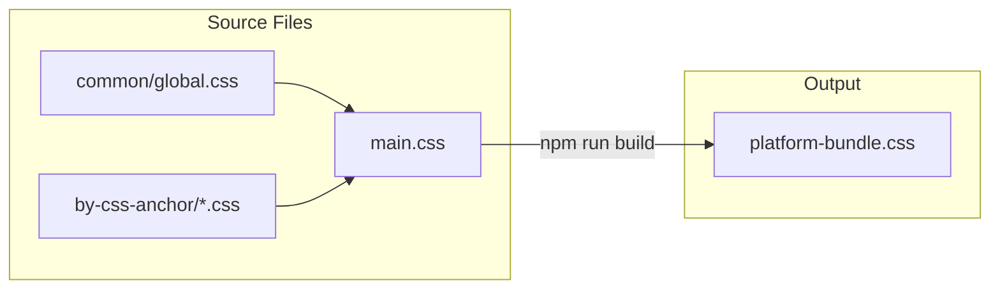
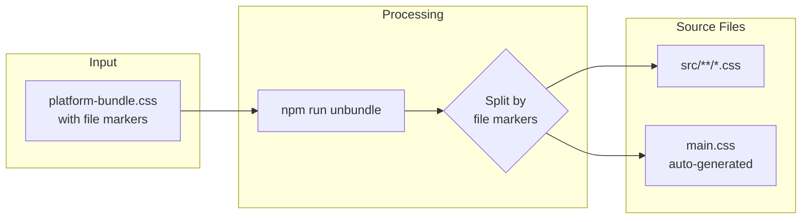
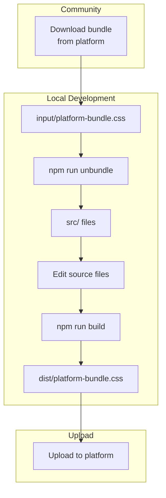

# Custom CSS Build System

A round-trip CSS build system for managing platform styles. Supports both **development** (building from source) and **reverse-engineering** (extracting from bundled CSS).

## Quick Start

```bash
npm install
npm run build      # Build CSS bundle from source
npm run unbundle   # Extract CSS from community bundle
```

## Folder Structure

```
custom-css/
├── input/                    # 📥 INPUT: Place community bundles here
│   └── platform-bundle.css   #    (downloaded from platform)
├── dist/                     # 📤 OUTPUT: Built bundles go here
│   └── platform-bundle.css
├── src/                      # 📝 SOURCE: Editable CSS files
│   ├── main.css              #    Entry point (imports all files)
│   ├── common/               #    Global styles
│   ├── by-css-anchor/        #    Widget styles (by data-css-anchor)
│   ├── pages/                #    Page-specific styles
│   └── parts/                #    Reusable component styles
└── scripts/                  # 🔧 Build tools
```

## Workflows

### Flow 1: Development (Source → Bundle)

Build CSS from source files into a single bundle.



**Commands:**
```bash
npm run build     # Build bundle from source
npm run dev       # Watch mode for development
```

---

### Flow 2: Reverse Engineering (Bundle → Source)

Extract CSS from a bundle back into organized source files using file markers.



**Commands:**
```bash
# 1. Place bundle in input folder
cp ~/Downloads/community-styles.css input/platform-bundle.css

# 2. Run unbundle (extracts files and generates main.css)
npm run unbundle
```

---

### Flow 3: Round-Trip (Full Cycle)

Complete workflow for syncing changes from community back to source and rebuilding.



---

## How It Works

The build injects `/* @file: path */` markers into the bundle. These markers track file boundaries, enabling unbundling back to source.

### Build Output Example

```css
/* @file: src/common/global.css */
body {
  margin: 0;
}

/* @file: src/pages/home.css */
.home-banner {
  background: #fff;
}
```

### Unbundle Process

1. Splits bundle by `/* @file: */` markers
2. Writes each section to its original path
3. Auto-generates `main.css` with @import statements

---

## Commands Reference

| Command | Description |
|---------|-------------|
| `npm run build` | Build CSS bundle from source |
| `npm run dev` | Start Vite dev server with HMR |
| `npm run unbundle` | Extract CSS from `input/platform-bundle.css` |

---

## Notes

- **Round-trip safe** - Build and unbundle preserve file structure
- **Markers required** - Unbundle only works with bundles built by this tool
- **main.css auto-generated** - Unbundle recreates main.css from markers
